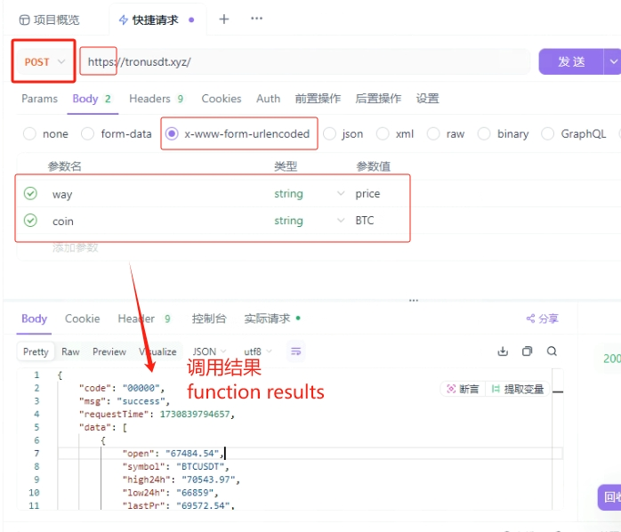
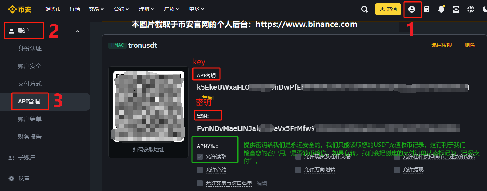

# tronusdt
主要功能:此框架用于快速为您的网站或APP接入USDT钱包功能或USDT收款功能，而无需任何区块链知识，涵盖交易查询\转币转账\收款回调等常用的Web接口API。支持Python\JAVA\NodeJs\PHP\GO\Ruby\C#\火山易语言等众多编程语言。下述USDT均指USTD-TRC20形式的USDT。TRX币和USDT共用同个收款地址的。     
**(有任何问题不要通过本帖子私聊、留言评论，很大可能不会有回复，请通过本页底部的邮箱联系我们即可，感谢理解)**  

### 框架优势
1:提供源码：目前提供了PHP源码和其他主流源码都有提供，即本页中payui.php文件，没错只需要1个文件，20行左右代码，即可运行这个框架或收款系统。     
2:可用性高：本框架长期可用，稳定性100%可用，长期有团队维护，截止更新日期目前有129个商家使用本框架集成USDT插件进行收款或钱包开发。    
3:零学习成本：无需懂任何区块链知识和技术，无需查看其他数字货币API开发文档。通过本页几个接口的调用即可制作USDT钱包功能，或给您的网站APP继承USDT收款功能。非常方便(No need to have any knowledge of blockchain)。     
4:完美兼容币安的链下USDT转账交易。这种交易0手续费且到账秒到，完全无需区块链确认。即用户和商家的USDT地址都为币安旗下。这是目前市面上所有USDT框架中本框架首创兼容(Support Binance internal transactions of USDT)。   

### 英文说明:
Rapid development of USDT wallet and collection, including web interface for transfer/callback.  
At present, the PHP source code is provided, which is the payui.exe file on this page. Yes, only one file and about 200 lines of code are needed to run this payment system.   
The following USDT refers to USDT in the form of USTD-TRC20. TRX coin and USDT share the same receiving address.  
If you are a user from the United States and Europe, we recommend that you use web translation to read this document.  
All interfaces must be accessed through POST, otherwise it is likely to prompt for missing parameters.  

#### 视频教程（Tutorial Video）  
[点此在线播放视频教程](https://mayizt.com/other_fun/tron.mp4)  
[我们在Youtube的演示,带中英双字幕版本](https://www.youtube.com/watch?v=raqksD9EOOs)  

视频教程分为:支付接口讲解、将密钥导入APP使用方法、尾数叠加解释等问题解答。易语言的可自行跳过。    
(在视频教程内均有以下源码的展示，可直接跳到您熟悉的编程语言进行播放了解。)  

|  编程语言   | PHP  | JavaScript  |  Python  |  易语言  |  Java  |  C++  |
|  ----  | ----  |   ----  |  ----  |  ----  |  ----  |  ----  |
|  Github是否提供参考源码  | 是  |   是  |  是  |  是   |  是  |  否  |
|  视频讲解大约开始时间  | 第3分钟  |   第5分钟  |  第15分钟  |  第21分钟   |  视频内未提及  |  视频内未提及  |

### 快速测试收款效果:
URL访问以创建支付订单：
>https://tronusdt.xyz/?way=payui  
  (↑推荐点击此处)    
>https://tronusdt.xyz/?way=payui&name=TJgooLjpQkZmxW1jgjscT8sCy7xaT4t8ZG&type=usdt&product=buy_apple&value=5&jump=3421664&auto=no  
 (↑直接创建订单并进入支付页)  

**参数说明**
|  参数名   | 说明  | 必须性  |  示例值  |
|  ----  | ----  |   ----  |  ----  |
| name  | 您的收款的USDT钱包地址 |  是 | TJgooLjpQkZmxW1jgjscT8sCy7xaT4t8ZG | 
| type  | 收款币种类型,仅支持usdt和trx两种 | 是 | usdt | 
| product  | 收款产品名字，仅作显示不宜太长 | 是 | 购买会员卡密 | 
| value  | 收款的货币的数量,必须大于等于1 | 是 | 5.0 | 
| jump  | 支付成功后提示的信息或跳转的网址或回调URL | 是 | https://baidu.com | 
| about  | 大约法币金额的显示(非数字币),可不填 | 否 | $32.00 | 
| service | 客服链接的显示(可https网址),可不填 | 否 | mailto:yuminhong@gamil.com |   
| auto  | 是否启用自动回调,仅支持yes或者async或者填no | 否 | no | 
| namepass | 新版新增参数:如果您的地址已创建商业保护，则需传入该密码参数才能生成支付订单,默认新地址可不填 | 否 | 35974982 |   

**注意:**  
+ name参数的钱包必须为通过tronusdt系统构建的钱包，或者也可以是您的币安USDT钱包地址(TRC20)。如果您想创建钱包，在way=creat接口或测试页面上点击创建钱包即可免费获得一个钱包，您可将私钥保存并导入到Imtoken，即可浏览钱包余额并进行转账等其他操作。  如果您想使用您的币安钱包作为USDT商家收款地址，创建订单前先 https://tronusdt.xyz/?way=bindui  进行币安钱包绑定。   
+ jump参数可填写为一个网址，则必须为http开头，它将在收款成功后进行页面跳转，如果您启动auto为回调模式(async/yes)，JUMP则代表后台回调URL。也可填写为一句话或一个商品卡密，它将在收款成功后显示出来。如您不懂此参数可以直接填写-，但不能留空。
+ 您可以将本仓库的payui.php源码复制到您的服务器，自行部署，且可以设置收款成功后自己的业务逻辑，比如支付后发送短信通知等均可以实现（JavaScript处）。
+ about仅做显示，意义不大。service是客服链接，不建议太长的网址或者包含&否则可能报错，建议填写邮箱即可。  
+ 去中心化链上交易，我们无法控制，放心使用。  

**182错误码：**  
如果生成订单时，提示182错误码。这是因为有不法人士使用攻击，攻击手段为采用自动脚本批量创建订单，导致该地址的支付金额不断抬高。所以目前并不是所有人都能针对TJgooLjpQkZmxW1jgjscT8sCy7xaT4t8ZG生成订单，我们为这个地址设置了调用IP白名单、以及设置了生成订单需要检验密码(传入正确的namepass参数)、或者输入验证码也能创建订单成功。  
如果您想处理并解决182错误码，请更换收款钱包地址即可（即修改name参数为你自己的地址，默认新建的钱包没有设置调用白名单和检验密码），或者如果您只是体验支付效果，可直接使用[UI页面]输入验证码即可跳过182检验,点开该网站即可体验支付功能：https://tronusdt.xyz/?way=payui  
这不是必要的选项，如果需要为您的地址设置商业保护，IP白名单或者创建支付订单需要检验所有权，可邮件联系我们免费设置即可。  

### auto参数自动回调介绍：    
**** auto有3个值可选，分别是no、yes和async，如果auto为空不传，则默认为no。****    
****(1)auto=no模式****      
此模式最开始的模式。创建订单后，用户需要手动点击支付界面上的[我已经支付]按钮去发起ajax请求检查订单是否支付成功，如果成功则页面发生jump跳转。   如果用户没有点击，支付页面如果还没有关闭的话，后台默认也会每隔几秒自动发起ajax请求调用[我已经支付]按钮事件。其本质是调用way=paycheck接口去主动检查订单是否支付。    

>这种情况有个缺陷，就是当用户创建订单后，关闭支付页面，然后进行了转币支付，如果转币成功，商家收到了币，用户由于关闭支付页面，支付页面，以及支付页面的[我已经支付]按钮也点击不到了，订单状态无法变为交易成功，导致用户也无法获得相应商品和服务。所以后来我们引入自动回调功能了，创建订单时指定auto=yes或auto=async，则用户哪怕关闭了支付页面，只要有支付成功(钱包收到USDT)，我们的服务器就会自动调用访问订单指定的jump上的网址（这不需要你做什么）。   

****(2)auto=yes模式****   
auto=yes提供的自动回调并不是实时回调，我们是在创建订单后的第5分钟和第15分钟进行订单支付状态检查。这是我们后台自己去发起这两次检查的（只要你创建订单时指定auto=yes）。  
当查询订单时auto还可能返回first和finish两个文本值。出现no表示订单没有开启自动后台回调，出现yes表示订单开启回调等待回调。出现first表示订单已经进行第一次检查支付状态（通常在订单创建后的第5分钟），出现finish表示订单已经在我们的服务器经历了2次订单支付状态检查（第5分钟和第15分钟）。这两次检查中如果订单为支付成功（status=1）则会以GET的形式自动访问下单时的jump参数URL。请自行在JUMP地址中添加订单号等信息。    

****(3)auto=async模式****    
auto=async提供的是立刻或接近实时的回调。但支持USDT币种的订单。只要数字货币地址(name)的账目上收到对应的币，JUMP回调很快甚至是立刻被访问和执行。这些也是全自动的。
当查询订单时auto可能返回asyncing和asyncok两个值，一开始下单是async的，如果auto变为asyncing，表示订单指定的商家数字货币地址(name)已经收到此订单的数字货币，但是jump中的链接系统还未读取访问。也就是以收到币但未回调完成。如果auto变为asynok，则表示商家数字货币地址(name)已经收到此订单的数字货币，而且jump中的链接已经被读取访问，回调完成了。  

****其他说明****     
除此之外要说的是，我们服务器调用jump的URL可能会多次。所以如果是增加金额充值类，请注意回调网址作好防重准备。  
auto=no时jump为页面跳转地址，如果auto为yes或async时，jump通常表示后台回调URL。数字货币一旦收到我们会自动回调访问jump上的网址链接。   
另外，我们可能不会在超过15分钟后进行auto自动订单支付状态检查，这是因为毫无必要，我们的订单有效期也在15分钟以内。  

### 我会其他编程语言，怎么构建自己的收款系统？
您也可以使用Python\JAVA等其他编程语言和平台构建您的USDT收款程序，只需要调用这里提供的2个接口：  
+ 第一个接口是：创建订单。创建成功返回订单号。
+ 第二个接口是：检查订单是否支付成功。支付成功则自定义一些事情。     
在整个开发过程中，无法熟悉区块链相关知识，甚至不懂比特币、波场、NFT知识也没关系。   
您可在1小时内构造出专属于您的收款系统，用您自己熟悉的编程语言。 

### 我不会任何一门编程语言，怎么构建自己的收款系统？
 
如果您连一门编程语言都不会，也没关系，有两种解决方法：  
+ 第一种将本页的内容和接口拿给某个程序员看，他也能快速构建出一个收款系统，对编程技能并不要求很高。开发成本非常低  
+ 第二种就是使用我们的已有的系统，https://tronusdt.xyz/?way=payui.php?name=.... 拼接您的收款链接，发送给别人进行支付即可。

--------------------------

### 其他接口说明
（英文:Access must be done POST and HTTPS.）  
以下接口均务必**使用HTTPS头并以POST方式访问**，少量同样支持GET。 
调用速率：每秒15QPS，接口长期稳定可用。  
这就是为什么wcode明明有传入，却一直提示需要传入参数wcode，这是因为你的调用方式为get导致的。  

#### 1、实时币价汇率查询API:  
（英文:Real time currency price and exchange rate query interface）   
> https://tronusdt.xyz/?way=price&coin=btc

注意：以POST访问，如果GET访问会提示缺少coin参数(下述接口也一样)。  
  
其中high24h代表24小时内最高成交价格，change24h代表24小时涨幅等信息。lastPr表示最新人民币价格。    

#### 生成钱包API:
（英文:To generate a free USDT wallet）   
（英文:Here we have obtained the 'wcode' that will be used later）  
> https://tronusdt.xyz/?way=creat&mail=[mail]    
注意：请将上边的[mail]替换为您的电子邮箱地址。此邮箱后续可以登录后台查看所有创建的支付订单。用于管理凭证等功能。  
请您务必记录调用返回的钱包地址、私钥、wcode(后边要用到）。    
此处没有返回12单词助记词，但没关系可另外通过代码自行将私钥转为单词词组即可，网上有代码教程。     
**生成的私钥记录下来，可以用于自动收款，也可以在imtoken、Bestwallet、币安等其他著名的数字货币钱包上导入，即可图形界面上操作钱包，查看余额，转账交易等。**  
**下述下载安装任一APP即可，当然不局限于这两款，反正记住有私钥：任何地方都可以恢复并显示您的钱包。**  
>https://imtoken.im (中国大陆可能打不开，打开后下载新建钱包，导入密钥即可使用)      
>https://tronusdt.xyz/?way=imtoken (imtoken的详细使用教程，含安卓安装包apk)      
>https://bestwallet.com/ (打开后下载新建钱包，导入密钥即可使用)  

#### 查看钱包余额等信息API:
（英文:To query the balance and information of the wallet's various items）  
> https://tronusdt.xyz/?way=info&wcode=[wcode]  
其中wcode是您之前调用way=creat创建钱包时会返回的。 balance_trx表示钱包剩余TRX余额，balance_usdt表示USDT余额，还有其他信息这里不做解释。  

#### USDT转账API（Transfer for USDT）:
> https://tronusdt.xyz/?way=send&wcode=[wcode]&to=[to]&value=[value]   
to表示收款人的钱包地址，value表示转账数量，转出手续费8-10TRX。没错，转出USDT消耗的是TRX。  

#### TRX转账API（Transfer for TRX）:
> https://tronusdt.xyz/?way=sendtrx&wcode=[wcode]&to=[to]&value=[value]  
to表示收款人的钱包地址，value表示转账数量，转出手续费0-1TRX。

#### 查询交易记录API（show transaction list）:
> https://tronusdt.xyz/?way=list&wcode=[wcode] (查询USDT交易记录)  
> https://tronusdt.xyz/?way=listtrx&wcode=[wcode] (查询TRX交易记录)

--------------------------

#### 针对收款支持的API（Payment and callback APIs）:
> https://tronusdt.xyz/?way=pay&name=[name]&type=[type]&product=[product]&value=[value]&jump=[jump]  
(↑创建一个收款订单，其中name表示收款人钱包地址)     
> https://tronusdt.xyz/?way=paycheck&oid=[oid]  
 (↑传入订单号判断是否支付成功)   
way=pay创建成功会返回一个qrcode的字段，它代表一个收款二维码图片，如果是前端界面的话，使用JavaScript语法:image.src='data:image/png;base64,'+qrcode即可显示图片。同时返回的oid表示订单号，可以调用way=paycheck&oid=[oid]检查订单是否已经成功支付，如果收到对应数量的数字货币，则成功支付，返回的status会为1。若为0表示未支付。
> https://tronusdt.xyz/?way=payui (访问将自动跳转到UI图形界面的订单创建界面)    
> https://tronusdt.xyz/?way=ui (访问将自动跳转到订单后台管理界面)

#### 我们完美支持币安站内链下转账（We support Binance internal transactions）:
如果您的商家收款地址为币安上的钱包地址，在使用way=pay生产支付订单时，请确保您的币安钱包已经在tronusdt本框架上绑定过了。
绑定的作用是，我们可以通过key调用币安API，查看一些站内交易信息。      
如果没有绑定，请打开 https://tronusdt.xyz/?way=bindui 填写几个参数即可绑定。   
绑定所需参数：您的联系邮箱（用于通知和查看支付订单等）、USDT钱包地址（这个必须和币安上USDT-TRC20网络的收款地址一样）、Key和密钥（在您的币安后台创建得到）。   
您可以通过币安官网的教程了解如何获取key和密钥:https://www.binance.com/zh-CN/support/faq/detail/360002502072   
您可以通过视频了解币安机制： https://www.binance.com/zh-CN/support/faq/detail/360002502072   

##### 绑定时填写key和密钥给你们，那么安全吗？  
新建的key和密钥默认只能读取账户内的基础数据，并不能进行币安账户进行合约、投资、转账等其他风险操作。我们仅通过key和密钥访问您的币安账户的USDT充值数据列表。我们没有权限可以去操控您的币安其他操作，因为币安的Key默认权限只能读取账户基础数据，没有划转、转账、交易等权限，除非您在API管理的后台给这个Key开启打勾上这些权限。这些都是币安API管理策略和币安官方帮助文档提到的。如果您依旧不放心，可以使用一个闲置的币安账户作为收款账户。        
  

##### 我们完美支持币安的站内链下转账。这是非常有用的功能。
传统用户转出USDT给商家的USDT钱包，走的是普通的USDT区块链网络，这会有有续费，这个手续费根据网络拥挤程度决定的。
当您使用币安作为您的商家USDT收款地址，假设用户也是币安用户，***即你们两个USDT账户都属于币安旗下的，那么这种转账币安不会把交易通过USDT区块链网络进行发送，而是在币安的内部进行转移***，即对一个账户进行减少操作，对另一个账户进行增加币数的后台操作，这对于币安非常容易做到。这样的好处除了到账速度快，还有0手续费等优点。币安和我们，会把这种交易成为站内或链下交易。    
***由于这种USDT转账不经过USDT区块链网络，区块链浏览器无法查询到，这就是为什么有些用户明明通过币安按付款界面的要求转账了USDT，但是商家却没有自动产生回调。这是很多USDT收款框架不支持这种站内链下转账的查询***。然而本框架完美兼容这种币安的站内或链下交易。   
当然读取一个币安账户的链下交易记录，没有办法通过区块链框架读取，只能和币安后台交互，这就是为什么我们需要您的币安账户的Key.通过Key我们可以访问您账户的部分数据。进而确定订单是否支付成功。   

##### 币安USDT钱包地址作为商家收款地址时，创建的支付订单不支持全自动回调auto=async。
需要注意的是币安USDT商家地址，创建支付订单时不支持auto=async。但是我们支持半自动回调模式，即auto=yes这种模式，用户也可以手动发送way=paycheck主动检查。访问way=paycheck的接口时，我们会通过key链接到您的币安USDT数据，通过比对您的币安USDT充值信息，进而判断某个订单用户是否支付成功。   
另外注意：需要注意的是币安USDT商家地址创建订单时，同样支持TRX订单，但auto依旧只是支持no/yes两种模式。       

--------------------------------------   
#### 金额叠加和支付标准（Payment Currency Overlay Explanation）
依据index.js中addvalue的技术参数，目前USDT的每次叠加币数为0.5，TRX的每次叠加币数为0.2。
即15分钟内或短期之内，当两个用户都准备支付8个USDT时，第一个用户显示出来的需要支付数为8个USDT，而第二个用户显示出来的所需支付数为8.5个USDT。   
这么做的目的是为了钱包收到币后，能区分是哪个用户支付的。        
由于0.5USDT数值不大，对用户来说并不构成太多实际的支付成本，一般情况也能接受。       
这在最开头的我们视频讲解中有提到，位于视频的44分钟20秒。     
***请提醒用户按要求进行支付，关于确认支付成功的标准，当创建了一个8USDT的支付订单，调用way=pay返回value=8 USDT，则商家的USDT钱包收到 [8.0(含)到8.5(不含8.5)]个USDT，则订单会被标记为支付成功。当创建了一个10USDT的支付订单，调用way=pay返回value=10.5 USDT，则商家的USDT钱包收到 [10.5(含)到11.0(不含11.0)]个USDT，则订单会被标记为支付成功。***      

#### 电报版本（Telegram Version） 
电报机器人Telegram版本可联系我索要源码。  

#### 域名被墙怎么办（Domain access error...）
目前我们的域名在美国、日本、韩国、新加坡、非洲、中国等地均能访问，如果访问不了请通过本页底部邮件联系我们获取最新的域名。或者如果只是中国大陆无法访问，请使用代理解决即可。。   
另外发送邮件标题和内容BACKUP的邮件发送到我们邮箱，24小时内会回复您获得最新备用域名。  

#### 其他功能和API（Need other...）?
如果上述接口没有满足您的需求，可以访问下述TRON的官方提供API开放文档自行开发接入。承接区块链系统开发、收款开发、功能建议、BUG反馈，可电子邮件联系我。
>https://tron.network  
>Email:usdtadmin@protonmail.com  
>USDT赞助打赏:TJgooLjpQkZmxW1jgjscT8sCy7xaT4t8ZG

#### 免责声明（Disclaimer）
1. tornusdt为USDT官方开源的API产品，仅用于学习交流使用！  
2. 不可用于任何违反中华人民共和国(含台湾省)或使用者所在地区法律法规的用途。  
3. 因为作者即本人仅完成代码的开发和开源活动(开源即任何人都可以下载使用或修改分发)，从未参与用户的任何运营和盈利活动。  
4. 且不知晓用户后续将程序源代码用于何种用途，故用户使用过程中所带来的任何法律责任即由用户自己承担。  

#### 警告贴士（Warn）
1. 项目中所涉及区块链代币均为学习用途，作者并不赞成区块链所繁衍出代币的金融属性。  
2. 亦不鼓励和支持任何"挖矿"，"炒币"，"虚拟币ICO"等非法行为。  
3. 虚拟币市场行为不受监管要求和控制，投资交易需谨慎，仅供学习区块链知识。  

