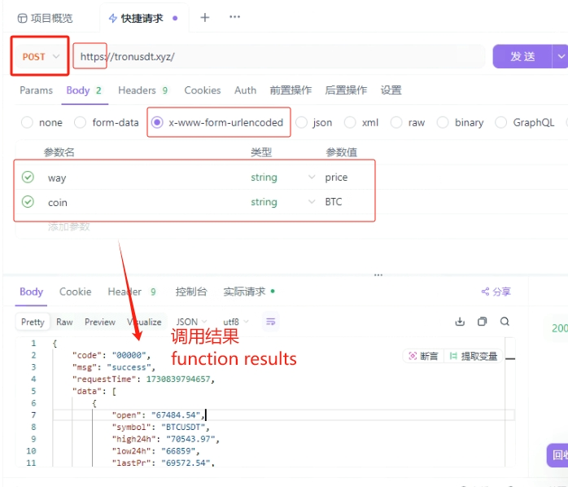
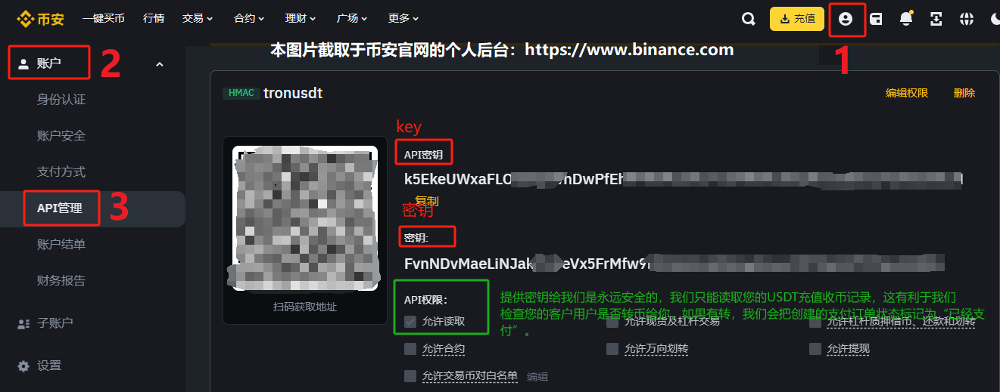

# tronusdt
Main functions: This framework is used to quickly access the USDT wallet function or USDT collection function for your website or APP without any blockchain knowledge. It covers common web interface APIs such as transaction query, currency transfer, and collection callback. Supports many programming languages ​​such as Python\JAVA\NodeJs\PHP\GO\Ruby\C#\Huoshan Yi Language. The following USDT all refer to USDT in the form of USTD-TRC20. TRX coins and USDT share the same payment address.
**(If you have any questions, please do not chat privately or leave comments through this post. There is a high probability that there will be no reply. Please contact us through the email at the bottom of this page. Thank you for your understanding)**
**(Actually, you can access it by yourself by reading this document and video. If you don’t know how, please contact me via email at the bottom for free help and guidance)**

### Framework advantages
1: Provide source code: Currently, PHP source code (payui.php) and other mainstream source codes are provided. Yes, each programming language only requires 1 file and about 20 lines of code to run this framework or payment system.
2: High availability: This framework is available for a long time, has 100% stability, and is maintained by a team for a long time. As of the update date, there are currently 129 merchants using this framework to integrate the USDT plug-in for payment collection or wallet development.
3: Zero learning cost: No need to understand any blockchain knowledge and technology, and no need to check other digital currency API development documents. You can create a USDT wallet function by calling several interfaces on this page, or inherit the USDT collection function to your website APP. Very convenient (No need to have any knowledge of blockchain).
4: Perfectly compatible with Binance’s off-chain USDT transfer transactions. This kind of transaction has zero handling fee and arrives in seconds, without the need for blockchain confirmation at all. That is, the USDT addresses of users and merchants are both owned by Binance. This is the first time this framework is compatible among all USDT frameworks currently on the market (Support Binance internal transactions of USDT).
5: Newly upgraded and compatible with all USDT protocols, it is the most useful USDT payment framework. .

### English description:
Rapid development of USDT wallet and collection, including web interface for transfer/callback.
At present, the PHP source code is provided, which is the payui.exe file on this page. Yes, only one file and about 200 lines of code are needed to run this payment system.
The following USDT refers to USDT in the form of USTD-TRC20. TRX coin and USDT share the same receiving address.
If you are a user from the United States and Europe, we recommend that you use web translation to read this document.
All interfaces must be accessed through POST, otherwise it is likely to prompt for missing parameters.  thank you!

#### Tutorial Video
[Video tutorial: Click here to play online - Comprehensive tutorial of this framework](https://tronusdt.xyz/?way=video&video=tron.mp4)      
[Video tutorial: Taking Python as an example, experience 3-minute high-speed access](https://tronusdt.xyz/?way=video&video=easy.mp4)       
[Our presentation on Youtube, with both Chinese and English subtitles](https://www.youtube.com/watch?v=raqksD9EOOs)    

The video tutorial is divided into: payment interface explanation, how to import the key into the APP, explanation of mantissa superposition and other questions and answers. You can skip the easy language ones by yourself.
(The following source code is displayed in the video tutorial. You can jump directly to the programming language you are familiar with to learn more.)

| Programming Language | PHP | JavaScript | Python | Easy Language | Java | C++ |
|  ----  | ----  |   ----  |  ----  |  ----  |  ----  |  ----  |
| Does Github provide reference source code | Yes | Yes | Yes | Yes | Yes | No |
| Approximate start time of video explanation | 3rd minute | 5th minute | 15th minute | 21st minute | Not mentioned in the video | Not mentioned in the video |

### Quickly test the payment effect:
URL access to create payment order:
>https://tronusdt.xyz/?way=payui
(↑Recommended click here)
>https://tronusdt.xyz/?way=payui&name=TJgooLjpQkZmxW1jgjscT8sCy7xaT4t8ZG&type=usdt&product=buy_apple&value=5&jump=3421664&auto=no&note=Please pay as soon as possible for the additional content at the end of the test
(↑Create an order directly and enter the payment page)
>way=pay and way=payui are different. The former returns json data to create an order, while the latter shows that in addition to creating an order, it also redirects the page to a payment graphical interface.
>The pay page can be built by yourself, and the source code is PHP and is provided in this warehouse.

**Parameter description**
| Parameter name | Description | Requirement | Example value |
|  ----  | ----  |   ----  |  ----  |
| name | Your USDT wallet address for payment | Yes | TJgooLjpQkZmxW1jgjscT8sCy7xaT4t8ZG |
| type | Payment currency type, only usdt and trx are supported | Yes | usdt |
| product | The name of the payment product, it is only for display and should not be too long | Yes | Purchase membership card password |
| value | The amount of currency to be paid, must be greater than or equal to 1 | Yes | 5.0 |
| jump | The information or jump URL or callback URL prompted after successful payment | Yes | https://baidu.com |
| about | Display of approximate fiat currency amount (not digital currency), optional | No | $32.00 |
| service | Display of customer service link (can be https URL), optional | No | mailto:yuminhong@gamil.com |
| auto | Whether to enable automatic callback, only supports yes or async or fill in no | no | no |
| namepass | New parameters in the new version: If commercial protection has been created for your address, you need to pass in this password parameter to generate a payment order. By default, the new address can be left blank | No | 35974982 |
| note | New parameters in the new version: Support appending html code or text at the bottom of the payment page. The length should not exceed very long. Generally, it is not a big problem. Only GET input is supported | No | Please pay as soon as possible if you have any questions, please contact customer service |

**Notice:**
+ The wallet of the name parameter must be a wallet built through the tronusdt system, or it can be your Binance USDT wallet address (TRC20). If you want to create a wallet, click Create Wallet on the way=creat interface or test page to get a wallet for free. You can save and import the private key to Imtoken to browse the wallet balance and perform other operations such as transfers.  If you want to use your Binance wallet as the USDT merchant payment address, bind your Binance wallet at https://tronusdt.xyz/?way=bindui before creating an order.
+ The jump parameter can be filled in as a URL, which must start with http. It will jump to the page after the payment is successfully received. If you start auto in callback mode (async/yes), JUMP represents the background callback URL. It can also be filled in as a sentence or a product card code, which will be displayed after the payment is successfully received. If you do not understand this parameter, you can directly fill in -, but cannot leave it blank.
+ You can copy the payui.php source code of this warehouse to your server and deploy it yourself. You can also set your own business logic after successful payment, such as sending SMS notifications after payment, etc. (JavaScript).
+ about is only for display and has little meaning. service is a customer service link. It is not recommended that the URL be too long or contain &, otherwise an error may be reported. It is recommended to fill in the email address.
+ Decentralized on-chain transactions are beyond our control, so you can use them with confidence.

**182 error code:**
If an order is generated, a 182 error code is displayed. This is because some unscrupulous people use attacks. The attack method is to use automatic scripts to create orders in batches, causing the payment amount of the address to continue to increase. So currently not everyone can generate an order for TJgooLjpQkZmxW1jgjscT8sCy7xaT4t8ZG. We have set up a calling IP whitelist for this address, and set up a password verification required to generate an order (pass in the correct namepass parameter), or enter a verification code to create an order successfully.
If you want to deal with and solve the 182 error code, please change the payment wallet address (that is, change the name parameter to your own address. By default, the newly created wallet does not set the call whitelist and verification password), or if you just experience the payment effect, you can directly use the [UI page] to enter the verification code to skip the 182 verification, and click on the website to experience the payment function: https://tronusdt.xyz/?way=payui
This is not a necessary option. If you need to set up commercial protection for your address, IP whitelist or create a payment order that requires ownership verification, you can contact us by email to set it up for free.

### Auto parameter automatic callback introduction:
**** auto has a total of 3 optional values, namely no, yes and async. If auto is empty and not passed, the default is no. ****
>Video explanation of auto parameters: https://tronusdt.xyz/?way=video&video=async.mp4

##### (1)auto=no mode
The initial mode of this mode. After creating an order, the user needs to manually click the [I have paid] button on the payment interface to initiate an ajax request to check whether the order is paid successfully. If successful, the page will jump.   If the user does not click and the payment page has not been closed, the background will automatically initiate an ajax request to call the [I have paid] button event every few seconds by default. Its essence is to call the way=paycheck interface to actively check whether the order is paid. .

>A flaw in this situation is that after the user creates an order, closes the payment page, and then transfers the currency for payment. If the currency transfer is successful and the merchant receives the coins, the user cannot click the [I have paid] button on the payment page, payment page, or payment page, and the order status cannot be changed to transaction success, resulting in the user being unable to obtain corresponding goods and services. So later we introduced the automatic callback function. When creating an order, specify auto=yes or auto=async. Even if the user closes the payment page, as long as the payment is successful (the wallet receives USDT), our server will automatically call the URL on the jump specified in the order (this does not require you to do anything).

##### (2)auto=yes mode
The automatic callback provided by auto=yes is not a real-time callback. We check the order payment status at the 5th and 15th minutes after the order is created. Our backend initiates these two checks by itself (as long as you specify auto=yes when creating an order).
When querying an order, auto may also return two text values: first and finish. If no appears, it means that the order has not enabled automatic background callback. If yes appears, it means that the order has enabled callback and is waiting for callback. The appearance of first means that the order has undergone the first check of payment status (usually the 5th minute after the order is created), and the appearance of finish means that the order has gone through 2 order payment status checks on our server (the 5th minute and the 15th minute). In these two checks, if the order is paid successfully (status=1), the jump parameter URL when placing the order will be automatically accessed in the form of GET. Please add the order number and other information to the JUMP address yourself.

##### (3)auto=async mode
auto=async provides immediate or near real-time callbacks. But orders in USDT currency are supported. As long as the corresponding currency is received in the account of the digital currency address (name), the JUMP callback will be accessed and executed quickly or even immediately. These are also fully automatic.
When querying an order, auto may return two values: asyncing and asyncok. The initial order is async. If auto changes to asyncing, it means that the merchant's digital currency address (name) specified in the order has received the digital currency of this order, but the link system in the jump has not yet read and accessed it. That is to say, the coin is received but no callback is completed. If auto changes to asynok, it means that the merchant's digital currency address (name) has received the digital currency of this order, and the link in the jump has been read and accessed, and the callback is completed.

****forger description****
If the callback status auto is forget, it means forgetting, that is, it has been checked multiple times, but the check results are all unpaid, and it will not be checked again, even if it is paid later. The order status is no longer checked and changed. Usually within the order validity period (within 15 minutes), unless auto=no, the system will automatically check. If the check is not paid, it will be checked again multiple times, but if it exceeds 15 minutes, it will no longer be checked. Even if you pay after 15 minutes, the order status will not be changed to success (status=1).

****Other instructions****
In addition to this, our server may call the jump URL multiple times. Therefore, if it is a recharge type that increases the amount, please pay attention to the callback URL and be prepared to prevent accidents.
When auto=no, jump is the page jump address. If auto is yes or async, jump usually represents the background callback URL. Once the digital currency is received, we will automatically call back and access the URL link on the jump.
In addition, we may not perform auto automatic order payment status checking after more than 15 minutes. This is because it is unnecessary and our order validity period is also within 15 minutes.

### I know other programming languages, how can I build my own payment system?
You can also use other programming languages ​​and platforms such as Python\JAVA to build your USDT collection program. You only need to call the 2 interfaces provided here:
+ The first interface is: Create an order. If the creation is successful, the order number will be returned.
+ The second interface is: check whether the order is paid successfully. If the payment is successful, some things will be customized.
During the entire development process, it doesn’t matter if you are not familiar with blockchain-related knowledge, or even don’t understand Bitcoin, Tron, and NFT.
You can construct your own payment collection system within 1 hour, using your own familiar programming language.

### I don’t know any programming language, how can I build my own payment system?
 
If you don’t even know a programming language, it doesn’t matter. There are two solutions:
+ The first method is to show the content and interface of this page to a programmer, and he can quickly build a payment system, which does not require high programming skills. Development costs are very low
+ The second option is to use our existing system, https://tronusdt.xyz/?way=payui.php?name=.... to splice your payment link and send it to others for payment.

--------------------------

### Other interface descriptions
(English: Access must be done POST and HTTPS.)
The following interfaces must **use HTTPS headers and be accessed in POST mode**, and a few also support GET.
Call rate: 15QPS per second, the interface is stable and available for a long time.
This is why wcode is clearly passed in, but it keeps prompting that the parameter wcode needs to be passed in. This is because your calling method is get.

#### 1. Real-time currency exchange rate query API:
（英文:Real time currency price and exchange rate query interface）
> https://tronusdt.xyz/?way=price&coin=btc

Note: If accessed via POST, if accessed via GET, it will prompt that the coin parameter is missing (the same applies to the following interfaces).
  
Among them, high24h represents the highest transaction price within 24 hours, and change24h represents the 24-hour increase and other information. lastPr represents the latest RMB price.

#### Generate wallet API:
(English: To generate a free USDT wallet)
（英文:Here we have obtained the 'wcode' that will be used later）
> https://tronusdt.xyz/?way=creat&mail=[mail]
Note: Please replace [mail] above with your email address. This email address can later be used to log in to the backend to view all created payment orders. Used to manage credentials and other functions.
Please be sure to record the wallet address, private key, and wcode returned by the call (to be used later).
The 12-word mnemonic phrase is not returned here, but it doesn't matter. You can also convert the private key into word phrases through code. There are code tutorials online.
**The generated private key is recorded and can be used for automatic collection, or it can be imported into other well-known digital currency wallets such as imtoken, Bestwallet, Binance, etc. You can operate the wallet on the graphical interface, check the balance, transfer transactions, etc. **
**Just download and install any of the APPs listed below. Of course, you are not limited to these two. Anyway, remember to have the private key: your wallet can be restored and displayed anywhere. **
>https://imtoken.im (It may not be open in mainland China. After opening it, download a new wallet and import the key to use)
>https://tronusdt.xyz/?way=imtoken (detailed tutorial on using imtoken, including Android installation package apk)
>https://bestwallet.com/ (Open it, download the new wallet, import the key and use it)

#### View wallet balance and other information API:
（英文:To query the balance and information of the wallet's various items）
> https://tronusdt.xyz/?way=info&wcode=[wcode]
The wcode is what was returned when you previously called way=creat to create a wallet. balance_trx represents the remaining TRX balance in the wallet, balance_usdt represents the USDT balance, and other information will not be explained here.

#### USDT transfer API (Transfer for USDT):
> https://tronusdt.xyz/?way=send&wcode=[wcode]&to=[to]&value=[value]
to represents the wallet address of the payee, value represents the transfer amount, and the transfer fee is 8-10TRX. That’s right, transferring USDT consumes TRX.

#### TRX transfer API (Transfer for TRX):
> https://tronusdt.xyz/?way=sendtrx&wcode=[wcode]&to=[to]&value=[value]
to represents the wallet address of the payee, value represents the transfer amount, and the transfer fee is 0-1TRX.

#### Query transaction record API (show transaction list):
> https://tronusdt.xyz/?way=list&wcode=[wcode] (query USDT transaction records)
> https://tronusdt.xyz/?way=listtrx&wcode=[wcode] (query TRX transaction records)

--------------------------

#### APIs supported for payment collection (Payment and callback APIs):
> https://tronusdt.xyz/?way=pay&name=[name]&type=[type]&product=[product]&value=[value]&jump=[jump]
(↑Create a payment order, where name represents the payee’s wallet address)
> https://tronusdt.xyz/?way=paycheck&oid=[oid]
(↑Input the order number to determine whether the payment is successful)
If way=pay is successfully created, it will return a qrcode field, which represents a payment QR code image. If it is a front-end interface, use JavaScript syntax: image.src='data:image/png;base64,'+qrcode to display the image. The oid returned at the same time represents the order number. You can call way=paycheck&oid=[oid] to check whether the order has been paid successfully. If the corresponding amount of digital currency is received, the payment is successful and the returned status will be 1. If it is 0, it means it has not been paid.
> https://tronusdt.xyz/?way=payui (access will automatically jump to the order creation interface of the UI graphical interface)
> https://tronusdt.xyz/?way=ui (access will automatically jump to the order backend management interface)

#### We perfectly support Binance internal off-chain transfers (We support Binance internal transactions):
If your merchant's payment address is a wallet address on Binance, when using way=pay to produce payment orders, please make sure that your Binance wallet has been bound to the tronusdt framework.
The purpose of binding is that we can call the Binance API through the key to view some on-site transaction information.
If there is no binding, please open https://tronusdt.xyz/?way=bindui and fill in a few parameters to bind.
Parameters required for binding: your contact email (used for notifications and viewing payment orders, etc.), USDT wallet address (this must be the same as the payment address of the USDT-TRC20 network on Binance), Key and secret key (created in your Binance backend).
You can learn how to obtain keys and key through the tutorial on Binance official website: https://www.binance.com/zh-CN/support/faq/detail/360002502072
You can learn about Binance KEY’s tutorial through the video: https://tronusdt.xyz/?way=video&video=biankey.mp4

##### I fill in the key and give it to you when binding. Is it safe?
The newly created keys and secret keys can only read the basic data in the account by default, and cannot perform other risky operations such as contracts, investments, transfers, etc. on the Binance account. We only access the USDT deposit data list of your Binance account through key and key. We do not have permission to control your other operations on Binance, because the default permissions of Binance Key can only read basic account data, and do not have permissions for transfers, transfers, transactions, etc., unless you enable these permissions for this Key in the API management background. These are mentioned in Binance API management policies and Binance official help documents. If you are still worried, you can use an idle Binance account as a receiving account.
  

##### We perfectly support Binance’s on-site off-chain transfers. This is a very useful feature.
When traditional users transfer USDT to merchants' USDT wallets, they use the ordinary USDT blockchain network. There will be a renewal fee. This fee is determined based on the degree of network congestion.
When you use Binance as your merchant's USDT payment address, assuming that the user is also a Binance user, ***that is, both of your USDT accounts belong to Binance, then Binance will not send the transaction through the USDT blockchain network, but transfer it within Binance***, that is, reduce the operation on one account and perform the background operation of increasing the number of coins on the other account. This is very easy for Binance to do. In addition to the fast payment speed, there are also advantages such as zero handling fees. Binance and we will turn this transaction into an on-site or off-chain transaction.
***Since this kind of USDT transfer does not go through the USDT blockchain network, it cannot be queried by the blockchain browser. This is why some users clearly transferred USDT through Binance according to the requirements of the payment interface, but the merchant did not automatically generate a callback. This is a query*** that many USDT collection frameworks do not support this kind of off-chain transfer within the site. However, this framework is perfectly compatible with this kind of Binance on-site or off-chain transactions.
Of course, there is no way to read the off-chain transaction records of a Binance account through the blockchain framework. It can only interact with the Binance backend. This is why we need the Key of your Binance account. Through the Key, we can access some data of your account. Then determine whether the order is paid successfully.

##### When the Binance USDT wallet address is used as the merchant's payment address, the payment order created does not support fully automatic callback auto=async.
It should be noted that the Binance USDT merchant address does not support auto=async when creating payment orders. However, we support semi-automatic callback mode, that is, auto=yes mode. Users can also manually send way=paycheck to proactively check. When accessing the interface of way=paycheck, we will link to your Binance USDT data through the key, and compare your Binance USDT recharge information to determine whether an order user has successfully paid.
Also note: It should be noted that when creating an order with the Binance USDT merchant address, TRX orders are also supported, but auto still only supports no/yes modes.

--------------------------------------   
#### Payment Currency Overlay Explanation
According to the technical parameters of addvalue in index.js, the current number of coins added per USDT is 0.5, and the number of coins added per time for TRX is 0.2.
That is, within 15 minutes or within a short period of time, when two users are ready to pay 8 USDT, the first user displays the required payment amount of 8 USDT, while the second user displays the required payment amount of 8.5 USDT.
The purpose of this is so that after the wallet receives the coins, it can distinguish which user paid.
Since the value of 0.5USDT is not large, it does not constitute too much actual payment cost for users, and is generally acceptable.
This is mentioned in our comprehensive video explanation at the beginning, located around 44 minutes and 20 seconds into the video.
***Please remind users to pay as required. Regarding the criteria for confirming successful payment, when a payment order of 8 USDT is created, calling way=pay returns value=8 USDT, and the merchant's USDT wallet receives [8.0 (inclusive) to 8.5 (exclusive 8.5)] USDT, then the user's order will be marked as a successful payment. When a payment order of 10 USDT is created, since the amount of 10 is occupied by other users during the same period, calling way=pay will return value=10.5 USDT. Then the merchant's USDT wallet receives [10.5 (inclusive) to 11.0 (excluding 11.0)] USDT, and the user's order will be marked as a successful payment. ***

#### What is the returned headlist?
The headlist returned when calling the check payment order way=paycheck represents the first 5 latest transaction records of the wallet. Note that if the order status is payment successful (status=1), the headlist will not be displayed. The headlist is used for debugging. If the headlist shows a transfer transaction, it means that the digital currency has been recorded on the public blockchain platform.

#### Telegram Version
For the Telegram version of the Telegram robot, please contact me to request the source code.

#### What to do if your domain name is blocked (Domain access error...)
Currently, our domain names can be accessed in the United States, Japan, South Korea, Singapore, Africa, China and other places. If you cannot access them, please contact us through the email at the bottom of this page to obtain the latest domain names. Or if it is only inaccessible from mainland China, please use a proxy to solve the problem. .
In addition, send a BACKUP email with the email title and content to our mailbox, and we will reply to you within 24 hours to obtain the latest alternative domain name.

#### Other functions and APIs (Need other...)?
If the above interfaces do not meet your needs, you can visit TRON’s official API open document below to develop and access it yourself. To undertake blockchain system development, payment collection development, function suggestions, and BUG feedback, you can contact me by email.
>https://tron.network
>Email:usdtadmin@protonmail.com
>USDT sponsorship reward:TJgooLjpQkZmxW1jgjscT8sCy7xaT4t8ZG

#### Disclaimer
1. tornusdt is the official open source API product of USDT and is only used for learning and communication!
2. It cannot be used for any purpose that violates the laws and regulations of the People's Republic of China (including Taiwan Province) or the region where the user is located.
3. Because the author himself has only completed the development and open source activities of the code (open source means that anyone can download, use or modify and distribute it), and has never participated in any operations and profit-making activities of users.
4. We do not know what purpose the user will subsequently use the program source code for, so any legal liability arising from the user's use shall be borne by the user himself.

#### Warning Tips (Warn)
1. The blockchain tokens involved in the project are all for learning purposes, and the author does not agree with the financial attributes of the tokens derived from the blockchain.
2. We also do not encourage or support any "mining", "coin speculation", "virtual currency ICO" and other illegal activities.
3. The market behavior of virtual currency is not subject to regulatory requirements and control, and investment transactions must be cautious. It is only for learning blockchain knowledge.

